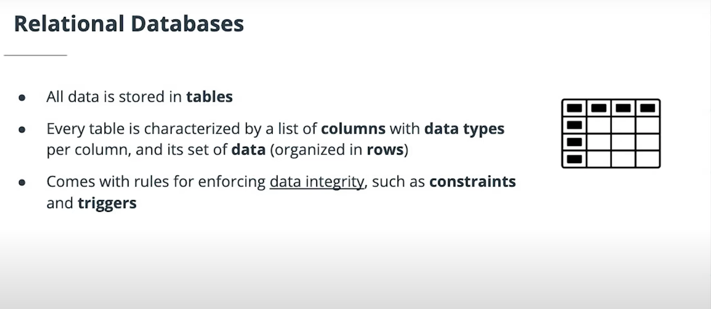
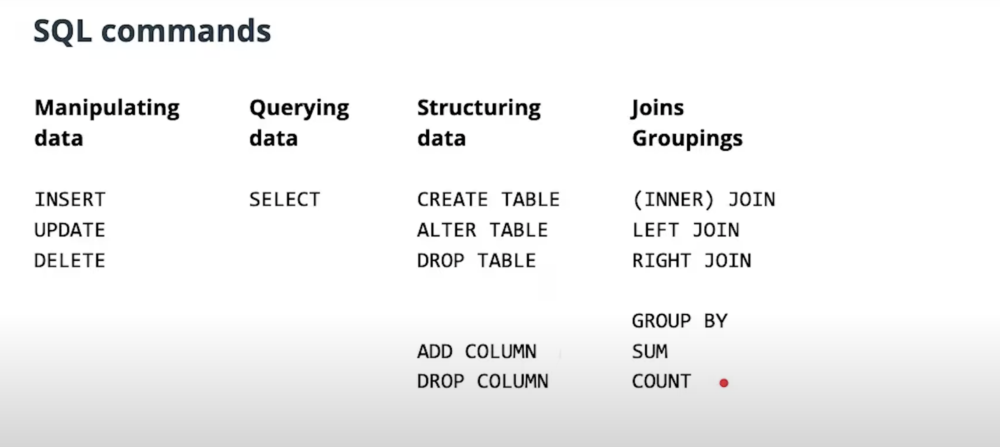

# Lesson 2: Interacting with Databases

## Lesson Overview
Remote storage requires the ability to do remote interactions with the database.

`psycopg2` is a database adapter that allows us to interact with a Postgres database from Python.

## Relational Databases

---
## SQL

