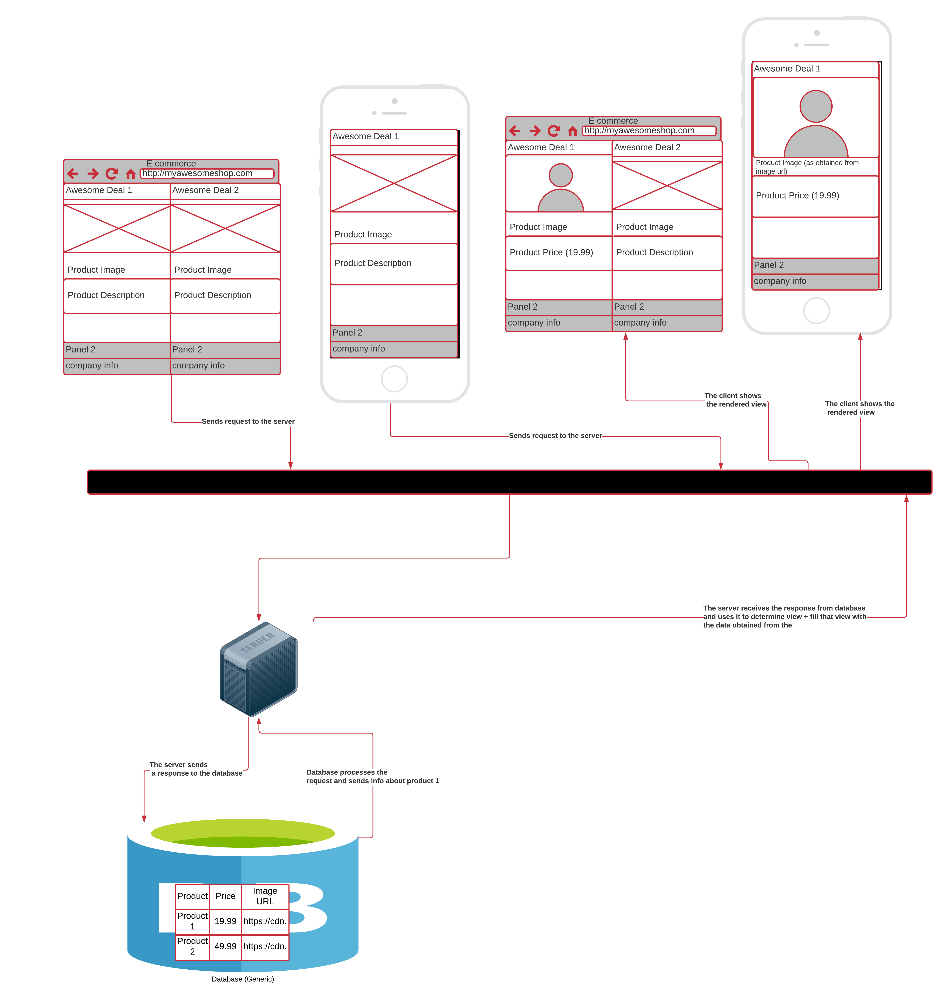

# Lesson 2: Interacting with Databases

## Lesson Overview
Remote storage requires the ability to do remote interactions with the database.

`psycopg2` is a database adapter that allows us to interact with a Postgres database from Python.

## Relational Databases

---
## SQL

***

## Client Server Model
- A server is a centralized program that communicates over a network (such as the internet) to serve *clients*.
- And a **client** is a program (like the web browser on your computer) that can request data from a server.

When you go to a web page in your browser, your browser (the client) makes a request to the server - which returns the data for that page.

Server Basics 1

Server Basics Broad

### Adding Database to the model
1. How do we interact with a database?
1. How do interactions with a database work?

- The server is centralized system that communicates over a network (the internet) to serve many clients. Servers and clients are program that run on a host. 
- A host is a computer connected over the network.

***

Server Basics Broad

> So to summarize *relational databe systems follow a client-server model*

***

### Server, Clients, Hosts
- In a Client-Server Model, a server serves many clients.
- Servers and clients are programs that run on hosts.
- Hosts are computers connected over a network(like the internet!).

### Requests and Responses
- A client sends a request to the server.
- The server's job is to fulfill the request with a response it sends back to the client.
- Request and response are served via a communication protocol, which sets up the expectations and rules for how the communication occurs between server and clients.

### Relational Database Clients
- A database client is any program that sends requests to a database
- In some cases, the database client is a web server! When your browser makes a request, the server acts as a server (fulfilling the request), but when the web server requests data from the database, it is acting as a client to that database - and the database is the server (because it is fulfilling the request).

> Basically we cal things clients when they are making a request and servers when they are fulfilling a request. Since the web server can do both, it sometimes acts as a server and sometimes acts as a client.

***

## Example: Jane's Store

### Client-Server Model Example: Jane's Store

#### Takeaways (Client Side Server Sdie for an E-Commerce)
- Clicking on the Polo product leads to a click event being registered by the browser, on the client computer.
- A click handler in the view would send a request to the server(in JavaScript) from the client browser.
- A client could request more *data* and a different view to be rendered (with that data)
- A server process listens to the request sent from the view. It fetches the data and chooses what to render next, using the fetched data.
  

Server Client Architecture

### Takeaways (Client-Server Side Communication)
- The client sends a request to the server, including information about the request type and any user input data.
- The server receives the request, and uses the user input data to determine how to shape its request to the database, and sends a request to the database.
- The database processes the request, and sends a response back to the web server.
- The server receives the response from the database, and uses it to determine the view+powers the view template with the fetched data, sending it back to the client's browser.
- The client is responsible for rendering something to the user, that represents both the data and its representation.

Server Client Communication

|Responsibility| party|
|--------------|------|
|Data representation and what the user sees| Client|
|Processing data requests from the web server| Database|
|Fulfilling client requests and updating the view| Web Server|

> **In Nutshell**
>  
> The **web server** receives a request from the **client (the front end)** and sends a request to the **database**, which sends back a response to the **web server**, which then **sends back a response to the client**.

## TCP/IP
- Postgres follows a client-server model that supports **Transmission Control Protocol (TCP)**/ **Internet Protocol(IP)** for communication.
- TCIP/IP uses:
  - IP addresses: identifying the location of computers on the network
  - Ports: describe where to receive traffic at a recipient computer, tied to physical location on a computer's motherboard.
    - 80: HTTP
    - 5432: most databse ports default port for Postgres

### Takeaways
- TCP/IP is a suite of communication protocols that is used to connect devices and transfer data over the internet.

## Connections and Sessions in TCP/IP

### Takeaways
- TCP/IP is a connection based, meaning all communication betwee nparties are arranged over a connection. A connection is established before any data transmission begins.
- Over TCP/IP, we always need to establish a connection between clients and servers in order to enable communications. Moreover
  - Deliveries over the connection are error-checked: if packets arrive damaged or lost they are resent (known as retransmission).
- Conncecting starts a session. Ending the connection ends the session.
- In a database session, many transactions can occur during a given session. Each transaction does work to commit changes to the database(updating, inserting or deleting records).

> A **connection** must be established to enable data transmission across a network using TCP/IP.
> Within a session, we encapsulate units of work that we commit as changes to a database in what we call **transaction**.
> 

## Transactions
- Databases are interacted using client-server interaction, over a network.
- Postgres uses TCP/IP to be interacted with, which is connection based.
- We interact with databases like Postgres during sessions
- Sessions have transactions that commit work to the database
- Transactions are atomic units of work for database to perform as a whole.
- <mark>Transactions capture operations that change a database's data</mark>: this means updates, inserts, and deletions of data. (UPDATE, INSERT, DELETE). Transactions are not concerned with querying (SELECT, GROUP BY) or changes to the data schema (ALTER TABLE).

## DBAPIs and psycopg2
We will sometimes want to interact with our database and use its results in a specific programming language, e.g., to build web applications or data pipelines in a specific lanuage(Ruby, Python, JavaScript, etc.). That's where DBAPI comes in.

- A DBAPI
  - provides a standard interface for one programming language (like Python) to talk to a relational database server.
  - is a low level library for writing SQL statements that connect to a database
  - is also known as database adapters.
- Different DBAPIs exist for every server fraework or language + database system
- Database adapters define a standard for using a database (with SQL and using the results of database queries as input data in the given langauge.
  - Turn a selected `SELECT * FROM some_table;` list of rows into an array of object in JavaScript for say a NodeJS adapter; or a list of tuples in Python for a Python adapter.
  
### Examples across languages and server frameworks
- For Ruby (e.g. for Sinatra, Ruby on Rails): [pg](https://www.ruby-toolbox.com/projects/pg)
- For NodeJS: [node-posgres](https://node-postgres.com/)
- For Python (e.g. for Flask, Django): [psycopg2](https://www.psycopg.org/)

## psycopg2
### psycopg2 Commands Summary

Psycopg2 Summary

## psycopg2: fetching results

### Steps for getting a database-backed web application up and running
Here is an overview of the list of tasks we'll need to do for a given web app to run with a database.
1. Create a database  in Postgres using `CREATE DATABASE` command
2. Establish a connection to the database We can connect to a Postgres server from a Python Web Server using psycopg2 with `psycopg2.connect()`.
3. Define and create your data schema  Execute CREATE TABLE commands to create the tables and define the schema(attributes, data types, etc) that will define what data gets housed for our web app.
4. Seed the database with initial data (Optional) Give the database some initial data, e.g., test data fir doing local development.
5. Creates routes and views  Creates routes in our server that will serve pages(views) to the client. Write up our HTML, CSS and JavaScript in our views. Then finally, to get our web app running
6. Run the server  Get the web server running
7. Deploy the server to the web. ... and that is, how we should build a web application backed by a database.

## Recap
- Connections
- Client-Server model
- TCP/IP
- Transactions and Sessions
- Various Postgres Clients
  - psql
  - psycopg2
