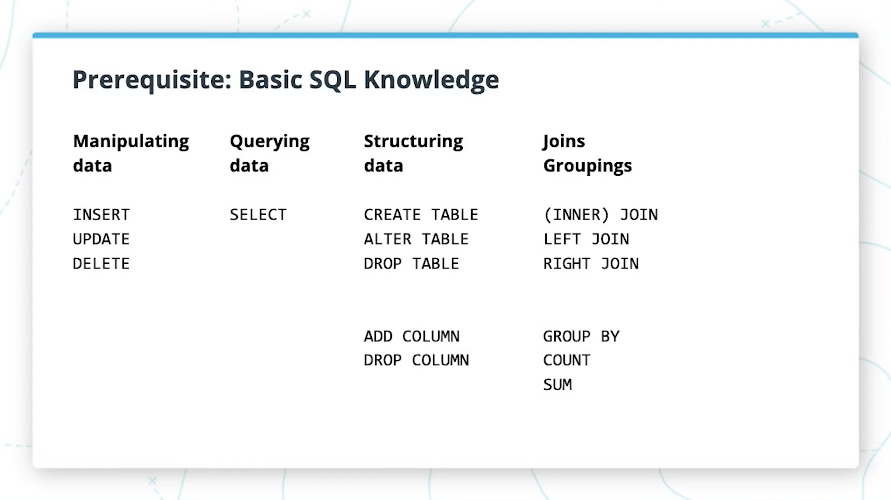

# Lesson 3: SQLAlchemy Basics

## Introduction

### Prerequisite: Basic SQL Knowledge

<center>Basic SQL Commands</center>

### What is an ORM
- ORM stands for Object relational mapping
- What does an ORM do?: It maps tables nad columns to class objects and attributes.
- An ORM allows us to interact with a database using object-oriented language like Python, rather than writing raw SQL.
### SQLAlchemy

- SQLALchemy is the most popular open-source library for working with relational databases from Python.
- Its one type of ORM library, AKA an Object-Relational Mapping library, which provides an interface for using object oriented programming to interact with a database.
- SQLALchemy
  - Features **function based query construction**: allows SQL clauses to be built via Python functions and expressions.
  - **Avoid writing raw SQL**. It generates SQL and python code for you to access tables, which leads to less database-related overhead in terms of the volume of code you need to write overall to interact with your models.
  - Moreover, you can **avoid sending SQL to the database on every call**.The SQLAlchemy ORM library features **automatic caching**, caching collections and references objects once initially loaded.

## Layers of Abstraction


<center>Without SQLAlchemy</center>

### Takeaways
- Without SQLAlchemy, we'd only use a DBAPI to establish connections and execute SQL statements.Simple, but not scalable as complexity grows.
- SQLAlchemy offers several layers of abstraction and convenient tools for interacting with a database.

### SQLAlchemy vs psycopg2
- SQLAlchemy **generates** SQL statements.
- psycopg2 directly **sends** SQL statements to the database.
- SQLAlchemy depends on psycopg2 or other database drivers to communicate with the database, under the hood.

### SQLAlchemy lets you traverse through all 3 layers of abstraction to interact with your database
- Can stay on the ORM level.
- Can dive into database operations to run customized SQL code specific to the database, on the Expressions level.
- Can write raw SQL to execute, when needed , on the Engine level
  - Can more simply use `psycopg2` in this case.

### Good Design Pratice (Opinion)
- Keep your code Pythonic. Work in classes an objects as much as possible.
  - Makes switching to a different backend easy in the future
- Avoid writing raw SQL until absolutely necessary

### Layers of SQLAlchemy
1. DBAPI
2. The dialect
3. The Connection Pool
4. The Engine
5. SQL Expressions
6. SQLAlchemy ORM (optional)


<center>Layers of SQLAlchemy</center>

### Why use SQLAlchemy over writing raw SQL?
- Work entirely in Python. Don't write raw SQL anymore
- Avoid making errors in SQL syntax
- <span style="text-decoration: underline;text-decoration-color: red;">More rapid web development</span>
- <mark>We can forget about the database system we're using</mark>
  -  Switch between SQLite for development, and Postgres for production

## The Dialect
> The dialect layer controls the quirks and flavors of the specific database system that we're using.

### The Connection Pool
- Uses a connection pool to easily resue existing connections
  - Avoid opening and closing connections for every data change
  - Handles dropped connections
  - Avoid doing very many small calls to the DB (very slow)

## The Engine

### The Engine
- 1 of 3 main layers for how you may choose to interact with the database.
- is the lowest level layer of interacting with the database, and is much like using the DBAPI directly. Very similar to using psycopg2, managing a connection directly.

Moreover,
- The engine in SQLAlchemy refers to both itself, the Dialect and the Connection Pool, which all work together to interface with our database.
- A connection pool gets automatically created when we create a SQLAlchemy engine.

## SQL Expressions
> SQLAlchemy SQL Expressions lets you compose SQL statements by building Python objects.

- Instead of sending raw SQL (using the Engine), we can compose Python objects to compose SQL expressions, instead.
- SQL Expressions still involves using and knowing SQL to interact with the database.

> So why would we want to use SQL Expressions to compose python objects and expressions for writing SQL? <mark>Becuase we can avoid doing SQL query string composition. SQL Expressions are just one step above writing raw SQL strings using string composition.</mark>


<center>SQLAlchemy Expressions</center>

## SQLAlchemy ORM

### Takeaways

**SQLAlchemy ORM**
- Lets you compose SQL expressions by mapping python classes of objects to tables in the database.
- in the highest layer of abstraction in SQLAlchemy
- Wraps the SQL Expressions and Engine to work together with the database
- Will be used in this course, so we can know how to use ORM libraries in general.

Moreover, SQLAlchemy is split into two libraries:
- SQLAlchemy Core
- SQLAlchemy ORM (Object Relational Mapping Library), SQLAlchemy ORM is offered as an ***optional*** library, so you don't have to use the ORM in order to use the rest of SQLAlchemy.
  - The ORM uses the Core library inside.
  - The ORM lets you map from the databse schema to application's Python objects
  - The ORM persists objects into corresponding database tables

### SQLAlchemy Layers of Abstraction Overview (Diagram)


<center>SQLAlchemy Layers of Abstractions</center>


|Description| Which Layers of Abstraction|
|-----------| ---------------------------|
|Implements protocol for connecting to a database.| **DPAPI** (Database layer)|
|Avoids opening and closing connections for every data change| The **connection pool** layer |
|Makes it possible to interact with any database management system, regardless of the SQL flavor used.| The **dialect** layer |
|Lowest layer of abstraction; looks a lot like interacting directly with a DB-API| The **engine** layer|
|Lets you compose SQL statements by building Python objects|The **SQL expressions** layer|
|Highest level of abstraction; maps classes to tables.| The **ORM** layer|

## Mapping between Tables and Classes

### Mapping between Tables and Classes
- Tables map to classes.
- Table records map to class objects.
- Table columns map to class atributes.

### Example

#### SQL Statement

```sql

CREATE TABLE tweets (
    id SERIAL PRIMARY KEY,
    content VARCHAR(140) NOT NULL
);

```
#### Equivalent Python Class

```python

class Tweet:
    def __init__(self, content):
        self.content = content

```

#### Python Object

```python

tweet = Tweet(content='hey!')
```

## Hello App With Flask-SQLAlchemy - Part 1

### Initializing the app
`app = Flask(__name__)` sets the name of your app to the name of the module ("app" if "app.py" is the name of your file).

### Using `@app.route`

```python

@app.route('/')
def index():
  ...
```
In this case, @app.route is a Python decorator. Decorator takes a function and returns another function, usually extending the input function with additional("decorated") functionality.
@app.route is a decorator that takes an input function `index()` as the callback that gets invoked when a request to route `/` comes in from a client.

## db.Model and Defining Models

Given an instance of the SQLAlchemy class fron the Flask-SQLAlchemy

```python
db = SQLAlchemy(app)
```
- db is an interface for interfacing with our database.
- `db.model` lets us create and manipulate **data models**.
- `db.session` lets us create and manipulate **database transactions**.