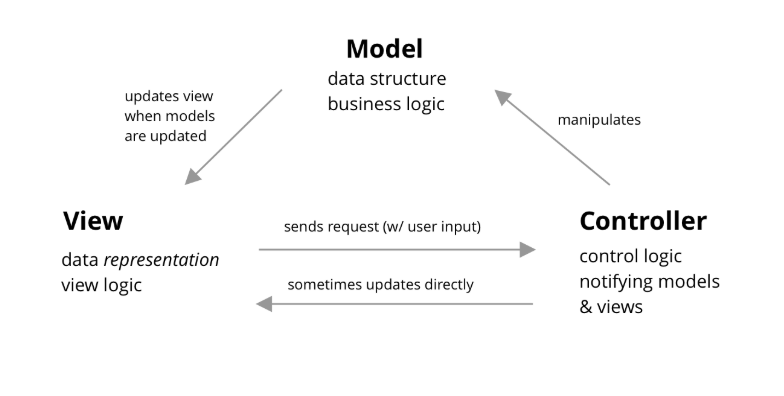
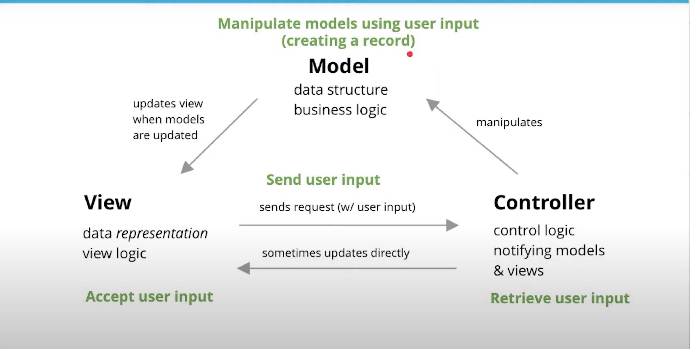
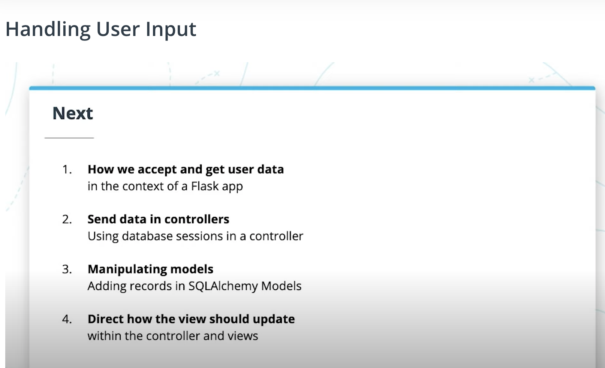
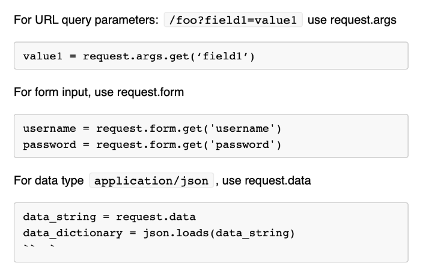

# Lesson 5: Building a  CRUD Application with SQLAlchemy

CRUD to Database to SQLAchemy Mapping

## Model View Controller
- MVC stands for Model-View-Controller, a common pattern for architecting web applications.
- Describe the 3 layers of the application we are developing.

### layers
|Layer| Description|
|:---:|:----------:|
|**Models**|manage data and business logic for us. What happens inside models and database, capturing logical relationships and properties across the web app objects.|
|**Views**|handles display and representation logic. What the user sees (HTML, CSS, JS from the user's perspective)|
|Controllers|routes commands to the models and views, containing control logic. Control how commands are sent to models and views, and how models and views wound up interacting with each other.|

### MVC In Nutshell
- The Model Layer: Manages data and business logic. Database query falls under the models part of MVC.
- The Views Layer: Handles display and representation logic
- The Controllers Layer: Routes commands to models and views

### MVC Diagram

Model-View-Controller Diagram

## Handling User input

MVC and User Input

MVC and Flask Todo Web App

## Getting User Data in Flask - part 1

There are three methods of getting user data  from a view to a controller.
1. URL Query parameters
2. Forms
3. JSON

Three methods of getting user data in Flask

### URL query parameter
- URL query parameters are listed as key-value pairs at the end of a URL, preceding a "?" question mark. E.g. `www.example.com/hello?my_key=my_value`

### Form data
- `request.form.get('<name>')` reads the `value` from a form input control (text input, number input, password input, etc) by the `name` attribute on the input HTML element.

### Note defaults
- `request.args.get`, `request.form.get` both accept an optional second parameter, e.g., `request.args.get('foo', 'my default')`, set to a default value, in case the result is empty.

### JSON
- `request.data` retrieves JSON as a string. Then we'd take that string and turn in into python constructs by calling `json.loads` on the `request.data` string to turn in into lists and dictionaries in Python.

### Getting HTML form submission to get the data
- forms take an `action`(name of the route) and `method`(route method) to submit data to our server.
- The `name` attribute on a form control element is the key used to retrieve data from `request.get(<key>)`.
- All forms either define a submit button, or allow the user to hit ENTER on an input to submit the form.

### Form methods `POST` vs `GET`
- The way form data traverses from the client to server differs based on whether we are using a GET or a POST method on the form.

#### The POST submission
- On submit, we send off an HTTP POST request to the route `/create` with a **request body**
- The request body stringifies the key-value pairs of fields from the form (as part of the `name` attribute) along with their values.

#### The GET submission
- Sends off a GET request with **URL query parameters** that appends the form data to the URL.
- Ideal for smaller form submission

> POSTs are ideal for longer form submissions, since URL query parameters can only be so long compared to request bodies (max 2048 characters). Moreover, forms can only send POST and GET requests, and nothing else.

## Getting User Data in Flask -Part 2

## Using AJAX to send data to flask
- Data requests are either synchronous or async (asynchronous)
- Async data requests are requests that get sent to the server and back to the client without a page refresh.
- Async requests (AJAX requests) use one of two methods:
  1. XMLHttpRequest
  2. Fetch (modern way)
